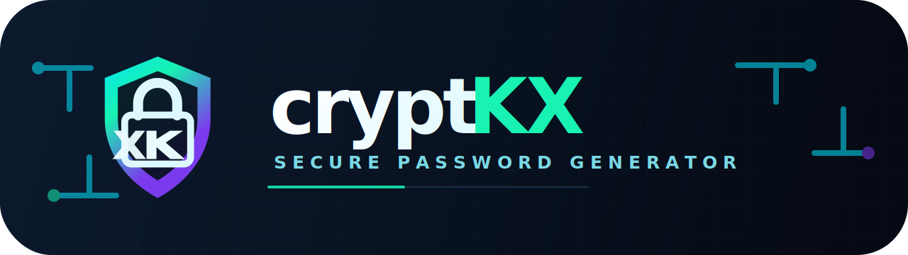

<div align="center">



# cryptKX

   

</div>

cryptKX is a small desktop password generator built with C++20, Qt 6/QML, and libsodium.

This English README is the primary project documentation. A Brazilian Portuguese translation is available in [docs/pt-br/README.md](docs/pt-br/README.md).

## Features

- Generates local passwords with a configurable length from 8 to 64 characters;
- Uses 20 characters by default;
- Lets the user enable uppercase letters, lowercase letters, digits, and symbols;
- Uses libsodium initialization and `randombytes_uniform()` for cryptographically suitable random selection;
- Exposes a Qt controller to QML and supports copying the generated password to the system clipboard;
- Keeps core password-generation tests registered through CTest.

## Requirements

The main supported Windows development environment is **MSYS2 MinGW64** with Ninja, Qt 6, and libsodium.

Install the required packages from an **MSYS2 MinGW64** shell:

```bash
pacman -S --needed base-devel mingw-w64-x86_64-toolchain mingw-w64-x86_64-cmake mingw-w64-x86_64-ninja mingw-w64-x86_64-pkgconf mingw-w64-x86_64-libsodium mingw-w64-x86_64-qt6-base mingw-w64-x86_64-qt6-declarative mingw-w64-x86_64-qt6-tools
```

The project requires:

- CMake 3.21 or newer;
- A C++20-capable MinGW64 compiler;
- Ninja;
- Qt 6.5 or newer with Core, Gui, Quick, Qml, and QuickControls2;
- libsodium.

If you build, test, or run from PowerShell instead of the MSYS2 MinGW64 shell, put the **MinGW64** binary directory first in that PowerShell session:

```powershell
$env:PATH = "C:\msys64\mingw64\bin;$env:PATH"
```

## Build

From an MSYS2 MinGW64 shell, or from PowerShell after setting the `PATH` shown above:

```bash
cmake -B build -S . -G Ninja -DCRYPTKX_BUILD_APP=ON
cmake --build build
```

`CRYPTKX_BUILD_APP=ON` builds the Qt/QML desktop executable. The default is also `ON` when `src/main.cpp` exists.

## Run

Run the built application from the same environment used for the build, or from PowerShell with `C:\msys64\mingw64\bin` on `PATH`:

```bash
.\build\cryptkx.exe
```

If you run the executable outside an MSYS2 MinGW64 terminal or a PowerShell session with the correct `PATH`, the required Qt, QML, MinGW runtime, and libsodium DLLs must be available on `PATH` or packaged next to the executable manually. This includes the Qt DLLs, QML/plugin directories, MinGW runtime DLLs, and `libsodium-*.dll`.

## Full Application Check

The repository currently registers core tests through CTest. For a full application check, build the app, run the tests, then launch the Qt/QML executable:

```bash
cmake -B build -S . -G Ninja -DCRYPTKX_BUILD_APP=ON -DBUILD_TESTING=ON
cmake --build build
ctest --test-dir build --output-on-failure
.\build\cryptkx.exe
```

Use this smoke checklist for the desktop app:

- The cryptKX window opens without QML import errors.
- The default password length is 20.
- The length control accepts values from 8 to 64.
- Uppercase, lowercase, digit, and symbol options can be toggled.
- Password generation updates the visible password.
- Copying the password places it on the system clipboard.

## Core-Only Test

Use a core-only build when you want to test password-generation logic without requiring Qt:

```bash
cmake -B build-core -S . -G Ninja -DCRYPTKX_BUILD_APP=OFF -DBUILD_TESTING=ON
cmake --build build-core
ctest --test-dir build-core --output-on-failure
```

This builds `cryptkx_core` and `cryptkx_core_tests`, then runs the CTest suite.

## Project Layout

This is the current project layout:
- `src/core`: pure password-generation logic, independent of Qt and clipboard access.
- `src/app`: Qt controller that adapts QML calls to the core generator and clipboard.
- `src/qml`: Qt Quick/QML user interface.
- `assets/brand`: vector brand assets, including the horizontal logo and app icon.
- `tests`: core tests registered with CTest.
- `cmake`: CMake helper modules, including libsodium discovery.
- `docs/`: supporting project notes in English and Brazilian Portuguese.

## Security Notes

Before using cryptKX, read the security notes:
- Passwords are generated locally by the application;
- cryptKX does not store generated passwords on disk;
- The generator validates length and selected groups before generating;
- libsodium is initialized before random generation and `randombytes_uniform()` is used to avoid modulo bias when selecting characters;
- Avoid replacing libsodium-backed generation with predictable generators such as `rand()` or `std::mt19937`;
- Copied passwords are placed in the operating system clipboard. Clipboard history tools or other applications may be able to read them.

For more details, see [Security notes](docs/en/security-notes.md).
